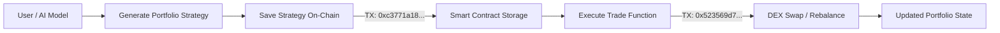

# IndexAI Protocol

IndexAI is an AI-powered on-chain asset management protocol that not only generates portfolio strategies, but also executes them directly via smart contracts.

> No manual trading. No off-chain bots. Everything happens on-chain.

---

## Overview

Managing DeFi portfolios requires constant monitoring, manual rebalancing, and complex decision-making.

IndexAI removes this friction by enabling AI-generated portfolio strategies that are both **stored and executed fully on-chain**.

---

## What It Does

* Generates AI-driven portfolio allocations
* Executes trades directly on-chain
* Stores portfolio state per user
* Enables reusable on-chain strategies
* Allows retrieval of portfolio and strategy data

---

## 🔄 Strategy Lifecycle

This diagram shows how AI-generated strategies are stored and executed fully on-chain.

---

## How It Works

1. User connects wallet
2. AI analyzes market conditions
3. AI generates optimal allocation
4. Strategy is stored on-chain
5. Smart contract executes trades
6. Portfolio and strategy data are updated and retrievable

---

## Architecture

* **Frontend** → Next.js
* **Backend** → Node.js (AI + API)
* **Smart Contracts** → Solidity (Hardhat)

---

## 🔗 HashKey Deployment (Final)

* **Network:** HashKey Chain Testnet
* **Contract:**
  0x36C02dA8a0983159322a80FFE9F24b1acfF8B570

### On-chain Proof

**Save Strategy (On-chain storage)**
https://testnet-explorer.hsk.xyz/tx/0xc3771a18a3f14d7628302c480bb18929e5227c21f1653ff0dc66d9dcb95e1485

**Execute Trade (On-chain execution)**
https://testnet-explorer.hsk.xyz/tx/0x523569d792921fe0a5673090be90564aa31d9a198ef5c7cda4b41f16e330b1da

> This demonstrates a complete on-chain lifecycle: strategy storage and execution within the same smart contract.

---

## On-Chain Capabilities

* Portfolio allocations are stored per user
* Strategies can be saved and reused
* Data is fully retrievable via smart contract functions

---

## ⚡ Why IndexAI is Different

* Not just signals → full on-chain execution
* Not off-chain bots → smart contract driven
* Not manual → AI-powered one-click execution

---

## Previous Deployment (Base Sepolia)

* Contract:
  0x1622c75F23C118047825dD03C1d827797eFE98d9

* TX:
  https://sepolia.basescan.org/tx/0x556d89d244f9bae3b27d2cb4ef51a60a55a1e5d5bcb166d357bd74a43cf669c7

---

## Status

Hackathon MVP — deployed on HashKey Chain with real on-chain execution, portfolio storage, and strategy reuse.

---

## Vision

IndexAI aims to become the AI layer for on-chain asset management, enabling autonomous, reusable financial strategies across DeFi ecosystems.